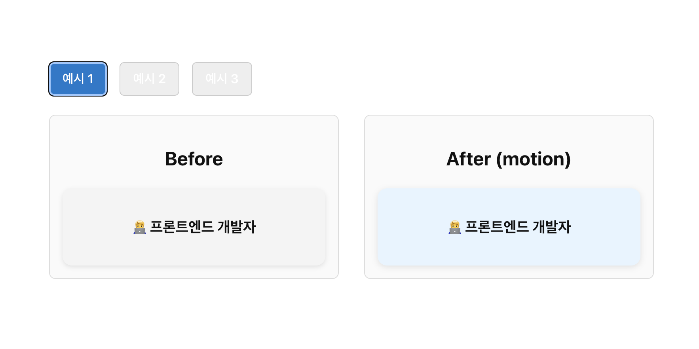

# Vue motion 실습 예제

> Reference: [https://motion.dev/docs/vue-motion-component](https://motion.dev/docs/vue-motion-component)



# 실행 순서

```
git clone https://github.com/C17AN/motion-vue-practice.git
npm install
npm run dev
```
